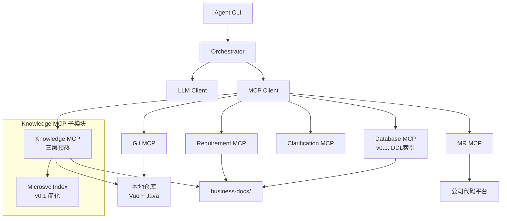
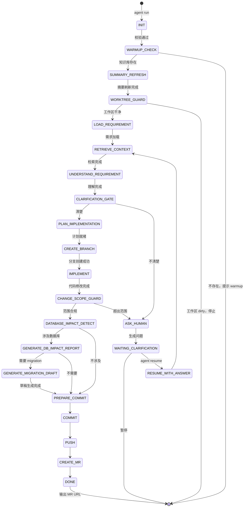
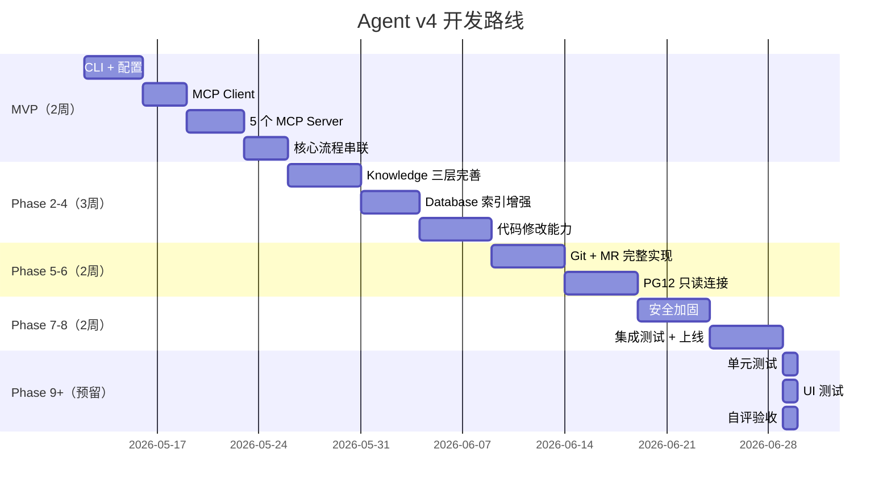

# 本地无服务器 MCP Agent 开发方案 v4.1（Agent 版）

> **文档版本**：v4.1 | **代码版本**：v0.2.0 | **目标读者**：AI Agent / 自动化开发工具  
> **变更摘要**：v4→v4.1 更新实施记录至 v0.2.0（P0~P8 全部完成），标记 MVP 已完成，补充代码优化阶段记录  
> **原始 v3→v4 变更**：收缩 v0.1 范围、取消 DB 写连接、强化只读安全约束、增加工作区保护 + 变更护栏 + 知识库失效规则、修复 Mermaid 语法

---

## 目录

1. [方案概览](#1-方案概览)
2. [v0.1 范围收缩](#2-v01-范围收缩)
3. [总体架构](#3-总体架构)
4. [预理解策略](#4-预理解策略)
5. [核心状态机](#5-核心状态机)
6. [MCP Server 规范](#6-mcp-server-规范)
7. [Database 策略（只读，无写连接）](#7-database-策略只读无写连接)
8. [Git 策略](#8-git-策略)
9. [安全边界](#9-安全边界)
10. [数据格式规范](#10-数据格式规范)
11. [配置文件规范](#11-配置文件规范)
12. [MR 描述模板](#12-mr-描述模板)
13. [分阶段开发计划](#13-分阶段开发计划)
14. [错误处理](#14-错误处理)
15. [附录](#15-附录)

---

## 1. 方案概览

### 1.1 核心决策

| 决策项 | 选择 |
|--------|------|
| 部署 | 本地 CLI，无服务器 |
| MCP 传输 | stdio |
| LLM | 公司内网 128K |
| 代码平台 | 公司自研（内部 MCP） |
| 数据库 | PostgreSQL 12 |
| ORM | MyBatis + MyBatis-Plus |
| 前端 | Vue |
| 数据库连接 | **只读，无写连接** |
| 测试 | **预留，v0.1 不处理** |

### 1.2 v3→v4 关键变更

```diff
- 取消 database.write_connection（v3 有写门控，v4 完全取消）
+ database.write.enabled: false，current_version_behavior: never_execute_write_sql
+ 只读查询安全约束：schema allowlist、敏感字段 denylist、statement timeout
+ Git diff 基准从 main 改为 {target_branch} + merge-base
+ 新增 WORKTREE_GUARD 工作区保护状态
+ 新增变更范围护栏：max_files、max_lines、deny_paths
+ 知识库失效 / 重建规则（cache invalidation）
+ Microsvc Dependency v0.1 并入 Knowledge MCP
+ 增加 2 周 MVP 里程碑
+ MR 描述强制标记"未测试"
+ Agent 版精简框架借鉴，只保留可执行规则
```

---

## 2. v0.1 范围收缩

### 2.1 v0.1 包含（MVP 核心）

```yaml
v0_1_scope:
  cli: [init, warmup, run, resume]
  mcp_servers:
    - knowledge_mcp        # 三层预热模型（简化版）
    - requirement_mcp      # 需求读取与解析
    - git_mcp              # 分支/commit/push
    - mr_mcp               # 创建 MR（内部 MCP）
    - clarification_mcp    # 澄清等待
  # Microsvc Dependency 作为 Knowledge MCP 的子模块
  # Database MCP v0.1 只做：DDL索引 + 文档索引 + 代码映射分析
  #                        不做：只读连接验证（v0.2）
  #                        不做：写连接（取消）
  target: "自动改代码 → commit → push agent/* → 创建 MR"
```

### 2.2 推迟到 v0.2/v0.3

```yaml
v0_2_scope:
  - database_mcp_advanced    # 只读连接验证（schema allowlist + SQL parser）
  - microsvc_dependency_mcp  # 独立为 MCP Server
  
v0_3_scope:
  - commit_style_learning    # 从 git history 学习团队风格
  - module_maintainer_inference  # 推断模块维护者
  - database_write_sql_draft_generation_only  # 生成写 SQL 草稿（不执行）
```

### 2.3 永远不做（安全红线）

```yaml
never:
  - database_write_connection
  - agent_execute_insert_update_delete
  - agent_hold_write_account
  - push_master_main_release_hotfix
  - auto_merge
  - auto_deploy
  - auto_execute_migration
```

---

## 3. 总体架构

### 3.1 架构图

```
┌─────────────────────────────────────────┐
│  Layer 1: CLI                           │
│  init | warmup | run | resume           │
├─────────────────────────────────────────┤
│  Layer 2: Orchestrator                  │
│  状态机 + 调度器 + 上下文管理              │
├─────────────────────────────────────────┤
│  Layer 3: Client                        │
│  LLM Client    |    MCP Client (stdio)  │
├─────────────────────────────────────────┤
│  Layer 4: MCP Servers (v0.1: 5 个)      │
│  Knowledge  |  Requirement  |  Database │
│  Git        |  MR           |  Clarify  │
├─────────────────────────────────────────┤
│  Layer 5: 数据源                          │
│  本地仓库  |  business-docs  |  内部平台  │
└─────────────────────────────────────────┘
```

### 3.2 模块交互图



---

## 4. 预理解策略

### 4.1 三层模型

| 层 | 频率 | 命令 | 产物 |
|----|------|------|------|
| Summary | 每次 run 前 | `git branch`, `git status`, `git log -50`, `git diff --stat {target_branch}..HEAD` | current_branch, recent_commits, diff_stat |
| Hotspot | warmup 构建，按配置刷新 | `git log -p -- core_modules`, `git blame key_files`, `git show key_commits` | core_module_history, file_blame, commit_style |
| Deep | 首次接入 / 重大变更 | 代码摘要索引、业务文档索引、数据库映射索引 | knowledge.sqlite, code_summaries.jsonl, db_schema_index.jsonl |

### 4.2 Git diff 基准（修复）

```yaml
git:
  target_branch: master          # 从 main 改为可配置 target_branch
  diff_base_strategy: merge_base  # 使用 merge-base 而非硬编码 main

# 实际命令：
# BASE=$(git merge-base HEAD origin/{target_branch})
# git diff --stat $BASE..HEAD
# git log --oneline $BASE..HEAD
```

### 4.3 知识库失效规则（新增）

```yaml
knowledge:
  invalidation:
    rebuild_summary_when:
      - always_before_run

    rebuild_hotspot_when:
      - target_branch_changed
      - files_changed_in_core_modules
      - ddl_changed
      - mapper_xml_changed
      - pom_xml_changed
      - package_json_changed

    rebuild_deep_when:
      - new_service_detected
      - database_schema_changed
      - route_structure_changed
      - mybatis_mapping_structure_changed
```

### 4.4 预理解频率配置

```yaml
knowledge:
  layers:
    summary:
      auto_refresh_before_run: true
    hotspot:
      auto_refresh_interval: "24h"     # 24h | 12h | 7d | manual
    deep:
      build_on_first_warmup: true
      rebuild_trigger: manual          # 手动触发，或重大变更时
```

---

## 5. 核心状态机

### 5.1 状态图



### 5.2 状态定义

| 状态 | 代码 | 说明 |
|------|------|------|
| INIT | 000 | 启动 |
| WARMUP_CHECK | 010 | 检查知识库 |
| SUMMARY_REFRESH | 015 | 刷新第一层摘要 |
| **WORKTREE_GUARD** | **018** | **工作区保护（新增）** |
| LOAD_REQUIREMENT | 020 | 加载需求 |
| RETRIEVE_CONTEXT | 030 | 检索上下文 |
| UNDERSTAND_REQUIREMENT | 040 | 理解需求 |
| CLARIFICATION_GATE | 050 | 澄清判断 |
| ASK_HUMAN | 060 | 生成问题 |
| WAITING_CLARIFICATION | 070 | 等待回复 |
| RESUME_WITH_ANSWER | 080 | 恢复执行 |
| PLAN_IMPLEMENTATION | 100 | 生成计划 |
| CREATE_BRANCH | 110 | 创建分支 |
| IMPLEMENT | 120 | 修改代码 |
| **CHANGE_SCOPE_GUARD** | **125** | **变更范围护栏（新增）** |
| DATABASE_IMPACT_DETECT | 130 | 数据库影响检测 |
| GENERATE_DB_IMPACT_REPORT | 135 | 生成影响报告 |
| GENERATE_MIGRATION_DRAFT | 140 | 生成 migration 草稿 |
| PREPARE_COMMIT | 150 | 准备提交 |
| COMMIT | 160 | 执行 commit |
| PUSH | 170 | 执行 push |
| CREATE_MR | 180 | 创建 MR |
| DONE | 200 | 完成 |

---

## 6. MCP Server 规范

### 6.1 v0.1 五个 Server

| Server | 职责 | v0.1 范围 |
|--------|------|-----------|
| Knowledge MCP | 三层预热 + 知识检索 | 三层模型 + 简化版微服务索引 |
| Requirement MCP | 需求读取与解析 | 同 v3 |
| Git MCP | 版本控制 | 同 v3 |
| MR MCP | 创建合并请求 | 同 v3 |
| Clarification MCP | 澄清沟通 | 同 v3 |

### 6.2 Database MCP v0.1（简化）

v0.1 只做文档索引，不做数据库连接：

```python
class DatabaseMCP:
    # v0.1 只做这些：
    async def index_ddl(ddl_dir: str) -> IndexResult
    async def index_mybatis_xml(xml_paths: List[str]) -> IndexResult
    async def search_database_schema(query: str) -> List[TableSchema]
    async def search_entity_table_mapping(...) -> List[Mapping]
    async def detect_database_risk(changes: List[CodeChange]) -> RiskReport
    async def generate_migration_draft(risk_report: RiskReport) -> List[Draft]
    
    # v0.1 不做这些（v0.2 再做）：
    # async def verify_query(...)        ← v0.2
    # async def sample_column_values(...) ← v0.2
    # 没有 write_connection             ← v4 已取消
```

### 6.3 Microsvc Dependency（v0.1 作为 Knowledge 子模块）

```python
class KnowledgeMCP:
    # Microsvc 作为 Knowledge 的子功能
    async def index_microsvc_structure(repo_path: str) -> ServiceGraph:
        """v0.1: 扫描服务目录、识别 Feign Client、生成依赖图谱"""
        
    async def find_affected_services(changed_files: List[str]) -> List[AffectedService]
```

v0.2 再独立为 `microsvc-dependency-mcp-server`。

---

## 7. Database 策略（只读，无写连接）

### 7.1 核心原则

```yaml
database:
  # v4 明确：没有写连接，没有写门控
  write_connection:
    enabled: false
    planned_phase: "never"          # 不是 future，是 never
    current_version_behavior: "never_execute_write_sql"
    
  # 只有文档索引
  mode: "local_docs_and_code_only"  # v0.1
  # mode: "readonly_verify"         # v0.2 可选开启
```

### 7.2 当前版本允许

```
读取 DDL 文件
读取数据库文档
只读文档索引（不连接数据库）
生成 migration 草稿
生成数据回填 SQL 草稿
MR 中标记 DBA / 后端 Owner review
```

### 7.3 当前版本禁止（安全红线）

```
Agent 执行 INSERT
Agent 执行 UPDATE
Agent 执行 DELETE
Agent 临时拿写账号
Agent 连接真实数据库（v0.1）
Agent 执行 migration
Agent 执行 DDL
Agent 执行 DML
```

### 7.4 v0.2 只读连接安全约束（预留）

当 v0.2 开启只读连接验证时，必须配置：

```yaml
database:
  readonly_verify:
    enabled: false                    # v0.1 默认关闭
    default_mode: "metadata_only"     # v0.2 开启后的默认模式
    allowed_modes:
      - metadata_only                # 只查 information_schema
      - explain_only                 # 只执行 EXPLAIN
      - sampled_select               # 采样查询（带严格限制）
    
    # 安全约束
    enforce_transaction_read_only: true
    statement_timeout_ms: 5000
    idle_timeout_ms: 3000
    max_rows_limit: 100
    max_query_cost: 10000
    
    # Schema / 表 / 字段级限制
    allowed_schemas: ["public", "app"]
    denied_tables:
      - "user_password"
      - "auth_token"
      - "session"
      - "secret"
    denied_columns:
      - "password"
      - "token"
      - "secret"
      - "id_card"
      - "phone"
      - "email"
    
    # SQL Parser 校验（推荐）
    sql_parser: "pg_query"            # pg_query | sqlglot | JSqlParser
    allowed_statement_types:
      - "SELECT"
      - "EXPLAIN"
      - "SHOW"
      - "SET LOCAL"
    denied_functions:
      - "pg_read_file"
      - "pg_read_binary_file"
      - "lo_import"
      - "lo_export"
```

### 7.5 写 SQL 处理策略

当需求涉及数据变更时：

```
Agent 检测到需要 INSERT/UPDATE/DELETE
  ↓
Agent 生成 write_sql_draft.sql（草稿）
Agent 生成 rollback_draft.sql（回滚方案）
  ↓
在 MR 描述中标记：
  "⚠️ 本 MR 涉及数据变更，需 DBA / 后端 Owner review 后执行"
  附上 write_sql_draft.sql 和 rollback_draft.sql 路径
  ↓
不执行任何 SQL
人类在正式流程中执行
```

---

## 8. Git 策略

### 8.1 工作区保护（新增）

```yaml
git:
  worktree_policy:
    require_clean_before_run: true      # run 前必须干净
    allow_untracked: false              # 不允许未跟踪文件
    stash_behavior: "stop_and_ask"      # dirty 时停止并询问
    
  # WORKTREE_GUARD 检查项
  worktree_guard_checks:
    - no_uncommitted_changes
    - no_untracked_files
    - no_merge_in_progress
    - no_rebase_in_progress
    - no_cherry_pick_in_progress
```

### 8.2 变更范围护栏（新增）

```yaml
change_policy:
  max_files_changed: 20
  max_lines_changed: 800
  
  deny_paths:                           # 禁止 Agent 修改的文件
    - "pom.xml"
    - "package-lock.json"
    - "yarn.lock"
    - "pnpm-lock.yaml"
    - "src/main/resources/application*.yml"
    - "src/main/resources/application*.yaml"
    - "Dockerfile"
    - "docker-compose*.yml"
    - ".github/**"
    - ".gitlab-ci.yml"
    - " Jenkinsfile"
    
  require_clarification_when:           # 改这些需要澄清
    - dependency_file_changed          # pom.xml / package.json
    - config_file_changed              # application.yml
    - auth_module_changed              # 权限模块
    - permission_module_changed        # 授权模块
    - database_schema_changed          # 表结构变更
    - more_than_max_files_changed      # 超出文件数限制
    - more_than_max_lines_changed      # 超出行数限制
```

### 8.3 分支与 Push 策略

```yaml
git:
  target_branch: master
  diff_base_strategy: merge_base
  
  branch_prefix: "agent/"
  branch_naming:
    template: "agent/{yyyyMMdd}-{task_slug}"
    regex: "^agent/[0-9]{8}-[a-z0-9][a-z0-9._-]{2,80}$"
    
  protected_branches:
    - "master"
    - "main"
    - "release/*"
    - "hotfix/*"
    
  push_policy:
    allowed_branch_regex: "^agent/[A-Za-z0-9._/-]+$"
    denied_branch_regex: "^(master|main|release/.*|hotfix/.*)$"
    
  allow_commit: true
  allow_push: true
  allow_create_mr: true
  allow_merge: false
  allow_force_push: false
```

### 8.4 Commit Message

```yaml
git:
  commit_message:
    template: "{type}: {summary}"
    regex: "^(feat|fix|refactor|chore|docs|style|perf|revert)(\\([A-Za-z0-9._-]+\\))?: .{1,100}$"
```

---

## 9. 安全边界

### 9.1 权限矩阵

| 资源 | 操作 | 状态 |
|------|------|------|
| 文件系统 | 读工作目录 | ✅ |
| 文件系统 | 读 ~/.ssh .env *.pem | ❌ |
| Git | status/diff/log | ✅ |
| Git | branch -c agent/* | ✅ |
| Git | push agent/* | ✅ |
| Git | push master/main/release/hotfix | ❌ |
| Git | merge | ❌ |
| Git | force push | ❌ |
| 数据库 | 读 DDL/文档 | ✅ |
| 数据库 | SELECT（v0.1 不做） | ⚪ |
| 数据库 | INSERT/UPDATE/DELETE | ❌ |
| 数据库 | DROP/TRUNCATE | ❌ |
| 系统 | git/python/node | ✅ |
| 系统 | sudo/rm -rf/kubectl | ❌ |

### 9.2 数据库安全（v0.1）

v0.1 完全不连接数据库，所有数据库理解来自：
- DDL 文件静态分析
- MyBatis XML / Entity 代码分析
- 数据字典文档

v0.2 开启只读连接后，启用完整安全约束（见 7.4 节）。

---

## 10. 数据格式规范

### 10.1 知识库产物

同 v3 三层模型产物格式。新增失效标记：

```json
{
  "generated_at": "2026-05-10T10:00:00Z",
  "invalidated_at": null,
  "invalidation_reason": null,
  "is_fresh": true
}
```

### 10.2 运行状态

```json
{
  "run_id": "20260510-001",
  "status": "DONE",
  "status_code": "200",
  "worktree_guard_passed": true,
  "change_scope_guard_passed": true,
  "files_changed": 5,
  "lines_changed": 120,
  "database_impact": {
    "affected_tables": ["order_info"],
    "migration_draft_generated": true,
    "write_sql_draft_generated": false,
    "dba_review_required": false
  }
}
```

---

## 11. 配置文件规范

### 11.1 完整 config.yaml

```yaml
# ============================================================
# Agent v4 配置文件
# 范围：v0.1 MVP（收缩版）
# ============================================================

project:
  name: "project-a"
  default_branch: "master"
  code_platform: "internal_custom"

runtime:
  mode: "local_mcp"
  transport: "stdio"
  llm_timeout_seconds: 120
  mcp_timeout_seconds: 30

task:
  stop_after_create_mr: true
  enable_tests: false           # v0.1 不做
  enable_unit_tests: false      # Phase 9+
  enable_ui_tests: false        # Phase 9+
  enable_self_review: false     # Phase 11+
  max_clarification_rounds: 3
  max_questions_per_round: 5

# ===== MCP Servers（v0.1: 5 个）=====
mcp:
  servers:
    knowledge:
      command: "python"
      args: ["-m", "agent_mcp.knowledge_server"]
      
    requirement:
      command: "python"
      args: ["-m", "agent_mcp.requirement_server"]
      
    database:
      command: "python"
      args: ["-m", "agent_mcp.database_server"]
      
    git:
      command: "python"
      args: ["-m", "agent_mcp.git_server"]
      
    mr:
      command: "python"
      args: ["-m", "agent_mcp.mr_server"]
      provider: "internal_mcp"
      
    clarification:
      command: "python"
      args: ["-m", "agent_mcp.clarification_server"]
    # Microsvc Dependency MCP: v0.1 并入 Knowledge
    # v0.2 独立: microsvc_dependency:

# ===== 分层预理解（三层模型）=====
knowledge:
  layers:
    summary:
      auto_refresh_before_run: true
      diff_base_strategy: "merge_base"        # 从 main 改为 merge-base
      target_branch: "${project.default_branch}" # 使用配置的 target_branch
      max_recent_commits: 50
      
    hotspot:
      build_on_warmup: true
      auto_refresh_interval: "24h"             # 24h | 12h | 7d | manual
      max_commits_to_scan: 100
      core_modules: []
      blame_key_files: []
      key_commit_patterns: ["schema", "refactor", "API", "migrate"]
      
    deep:
      build_on_first_warmup: true
      rebuild_trigger: "manual"
      
  # 知识库失效规则（新增）
  invalidation:
    rebuild_summary_when:
      - always_before_run
    rebuild_hotspot_when:
      - target_branch_changed
      - files_changed_in_core_modules
      - ddl_changed
      - mapper_xml_changed
      - pom_xml_changed
      - package_json_changed
    rebuild_deep_when:
      - new_service_detected
      - database_schema_changed
      - route_structure_changed
      - mybatis_mapping_structure_changed
      
  business_docs_dir: "./business-docs"

# ===== Database（v0.1: 只读文档索引，无连接）=====
database:
  enabled: true
  type: "postgresql"
  version: "12"
  orm: ["mybatis", "mybatis_plus"]
  
  # v0.1: 只读文档和代码，不连接数据库
  mode: "local_docs_and_code_only"
  
  sources:
    local_database_docs: "./business-docs/database"
    ddl_dir: "./business-docs/database/ddl"
    data_dictionary_dir: "./business-docs/database/data-dictionary"
    
  postgresql_12:
    detect_features:
      jsonb: true
      array_type: true
      enum_type: true
      uuid: true
      timestamp_with_timezone: true
      generated_columns: true
      partial_index: true
      gin_index: true
      expression_index: true
      
  mybatis:
    mapper_xml_paths:
      - "src/main/resources/mapper/**/*.xml"
      - "src/main/resources/mybatis/**/*.xml"
    java_mapper_paths:
      - "src/main/java/**/*Mapper.java"
      - "src/main/java/**/*Dao.java"
      
  mybatis_plus:
    entity_paths:
      - "src/main/java/**/*Entity.java"
      - "src/main/java/**/*DO.java"
    detect_annotations:
      - "@TableName"
      - "@TableId"
      - "@TableField"
      - "@Version"
      - "@TableLogic"
      - "@EnumValue"
      
  migration:
    allow_generate_draft: true
    allow_execute: false                    # 永远不允许
    draft_output_dir: ".agent/runs/{run_id}/database/migration-drafts"
    require_dba_review: true
    blocked_sql_patterns:
      - "\\bDROP\\s+TABLE"
      - "\\bTRUNCATE"
      - "\\bDELETE\\s+FROM"
      - "\\bUPDATE\\b(?![\\s\\S]*\\bWHERE\\b)"
      
  # v4: 写连接已取消
  write_connection:
    enabled: false
    current_version_behavior: "never_execute_write_sql"
    
  # v0.2 预留：只读连接验证（默认关闭）
  readonly_verify:
    enabled: false                          # v0.1 关闭
    v0_2_config:
      default_mode: "metadata_only"
      enforce_transaction_read_only: true
      statement_timeout_ms: 5000
      max_rows_limit: 100
      allowed_schemas: ["public", "app"]
      denied_tables: ["user_password", "auth_token", "session"]
      denied_columns: ["password", "token", "secret", "id_card", "phone", "email"]
      sql_parser: "pg_query"

# ===== Git 策略（含新增保护）=====
git:
  target_branch: "master"                   # 可配置，不是硬编码 main
  diff_base_strategy: "merge_base"
  
  branch_prefix: "agent/"
  branch_naming:
    template: "agent/{yyyyMMdd}-{task_slug}"
    regex: "^agent/[0-9]{8}-[a-z0-9][a-z0-9._-]{2,80}$"
    
  protected_branches: ["master", "main", "release/*", "hotfix/*"]
  
  push_policy:
    allowed_branch_regex: "^agent/[A-Za-z0-9._/-]+$"
    denied_branch_regex: "^(master|main|release/.*|hotfix/.*)$"
    
  commit_message:
    template: "{type}: {summary}"
    regex: "^(feat|fix|refactor|chore|docs|style|perf|revert)"
    
  # 工作区保护（新增）
  worktree_policy:
    require_clean_before_run: true
    allow_untracked: false
    on_dirty: "stop_and_ask"
    
  allow_commit: true
  allow_push: true
  allow_create_mr: true
  allow_merge: false
  allow_force_push: false

# ===== 变更范围护栏（新增）=====
change_policy:
  max_files_changed: 20
  max_lines_changed: 800
  
  deny_paths:
    - "pom.xml"
    - "package-lock.json"
    - "yarn.lock"
    - "pnpm-lock.yaml"
    - "src/main/resources/application*.yml"
    - "src/main/resources/application*.yaml"
    - "Dockerfile"
    - "docker-compose*.yml"
    - ".github/**"
    
  require_clarification_when:
    - dependency_file_changed
    - config_file_changed
    - auth_module_changed
    - permission_module_changed
    - database_schema_changed
    - more_than_max_files_changed
    - more_than_max_lines_changed

# ===== MR 配置 =====
mr:
  provider: "internal_mcp"
  target_branch: "master"
  title_template: "[Agent] {task_title}"
  description_template: ".agent/templates/mr_description.md"

# ===== 澄清配置 =====
clarification:
  enabled: true
  default_mode: "manual_copy"
  max_questions_per_round: 5
  max_clarification_rounds: 3
  
  ask_when:
    requirement_conflict: true
    missing_api_contract: true
    business_rule_ambiguous: true
    permission_or_status_flow_ambiguous: true
    data_model_change_required: true
    database_schema_unclear: true
    enum_value_unclear: true
    unclear_target_module: true
    dependency_file_changed: true       # 新增
    exceeds_change_scope: true           # 新增

# ===== 检索权重 =====
retrieval_weights:
  current_code: 1.00
  directly_referenced_files: 1.00
  business_docs: 0.90
  database_schema_docs: 0.90
  database_entity_mapping: 0.88
  java_controller: 0.85
  java_service: 0.85
  java_mapper: 0.85
  java_entity: 0.85
  vue_route: 0.80
  vue_api_client: 0.80
  vue_component: 0.75
  historical_mr_description: 0.65
  code_comments: 0.55
  commit_diff_history: 0.45
  file_path_match: 0.45
  freshness: 0.40
  commit_message: 0.20

# ===== 安全边界 =====
security:
  allowed_paths: [".", "./business-docs", "./.agent"]
  deny_paths: ["~/.ssh", "~/.git-credentials", ".env", "*.pem", "*.key"]
  blocked_commands: ["sudo", "rm -rf /", "kubectl", "terraform apply"]

# ===== 测试预留（Phase 9+）=====
testing:
  _comment: "Reserved for Phase 9+. Do not enable in v0.1."
  unit_test_framework: "junit5"
  ui_test_framework: "playwright"
  coverage_tool: "jacoco"
  auto_run: false
```

---

## 12. MR 描述模板

### 12.1 强制标记"未测试"（新增）

```markdown
## 自动化执行情况

已执行：
- [x] 需求读取
- [x] 代码上下文检索
- [x] 代码修改
- [x] commit
- [x] push
- [x] MR 创建

未执行：
- [ ] 单元测试
- [ ] UI 测试
- [ ] 自评验收
- [ ] 覆盖率检查
- [ ] 数据库 migration 执行

Reviewer 需重点关注：
1. 业务逻辑正确性
2. 边界条件
3. 是否需要补测试
4. 数据库影响是否合理
```

---

## 13. 分阶段开发计划

### 13.1 2 周 MVP（新增）

### 13.1 MVP 里程碑 ✅ 已完成

> **状态**：✅ 已于 2026-05-11 完成，实际用了 1 天（并行开发）

```
原计划（14天）→ 实际完成：
Day 1-2:   CLI + 配置             ✅ 完成
Day 3-4:   MCP Client + Server    ✅ 完成
Day 5-6:   5 个 MCP Server 骨架   ✅ 完成
Day 7-8:   Knowledge MCP 简化版   ✅ 完成
Day 9-10:  MR MCP + Clarification MCP ✅ 完成
Day 11-12: 核心流程串联           ✅ 完成
Day 13-14: 端到端测试 + 修复       ✅ 完成（86项测试通过）

验收标准：一个简单需求能跑完全流程并创建 MR ✅
```

### 13.2 完整路线图



### 13.3 版本演进（实际）

| 版本 | 阶段 | 状态 | 新增能力 |
|------|------|------|---------|
| v0.1.1 | P0 | ✅ | BaseMCPServer基类、Tracing日志、多语言支持 |
| v0.1.2 | P0 | ✅ | CodeParser(6格式)、状态级错误恢复 |
| v0.1.3 | P0 | ✅ | pip install可用、resume重做、状态分级 |
| v0.1.4 | P1 | ✅ | 100% MCP驱动、Knowledge持久化、@@PATCH |
| v0.1.5 | P2 | ✅ | 企业内网默认、LLM_API_KEY、Clarification落文件 |
| v0.1.6 | P3 | ✅ | Profiles、全MCP化subprocess、MyBatis/Vue深度 |
| v0.1.7 | P4 | ✅ | DB只读验证(metadata_only)、安全黑名单16项 |
| v0.1.8 | P5 | ✅ | apply_unified_diff引擎、DB影响交叉分析 |
| v0.1.9 | P6 | ✅ | SELF_REVIEW、Resume注入、Dry-run模式 |
| v0.2.0 | P7 | ✅ | Run report、Budget控制、Knowledge自重建 |
| P8 | P8 | ✅ | 全量代码优化：去方法级import、去硬编码URL |

> **当前版本**：v0.2.0，86/86 测试通过，双仓库（Windows + Linux）同步维护

---

## 14. 错误处理

### 14.1 新增错误类型

| 错误 | 原因 | 恢复 |
|------|------|------|
| WORKTREE_DIRTY | 工作区有未提交更改 | 提交或 stash 后 resume |
| CHANGE_SCOPE_EXCEEDED | 超出变更范围限制 | 缩小范围或手动确认后 resume |
| PROTECTED_FILE_CHANGED | 尝试修改受保护文件 | 手动修改或澄清后 resume |
| WRITE_SQL_DENIED | v4 中永远触发 | Agent 生成草稿，人类执行 |

---

## 15. 附录

### 15.1 设计借鉴（精简版）

只保留可执行规则：

```yaml
design_decisions:
  # 从 Cline 借鉴
  file_edit_mode: "diff_patch"          # 不用覆盖，用 diff
  context_management: "layered"         # 分层上下文
  
  # 从 Continue.dev 借鉴
  code_retrieval: "rag_with_weights"    # RAG 检索 + 权重
  
  # 从 Copilot Workspace 借鉴
  task_decomposition: "plan_json"       # plan.json 任务分解
  
  # 自定义（安全优先）
  database_access: "docs_only_v01"      # v0.1 只读文档
  git_safety: "branch_isolation"        # agent/* 分支隔离
  change_control: "scope_guard"         # 变更范围护栏
```

### 15.2 启动检查清单

```
□ Python 3.10+
□ 内网 LLM 接口
□ business-docs/database/ddl/
□ business-docs/database/data-dictionary/
□ Git push agent/* 权限
□ 公司代码平台 MCP 接口
□ 执行 agent init
□ 执行 agent warmup
□ 执行 agent run --task test.md
```

---

> **文档结束**。v4 核心变更：收缩 v0.1 范围、取消 DB 写连接、强化只读安全、新增工作区保护 + 变更护栏 + 知识库失效规则、2 周 MVP 里程碑。

---

## 16. 实施变更记录

### v0.1.4 (2026-05-11) — P1 MCP化

**Orchestrator MCP集成**：
- `orchestrator.py`: CREATE_BRANCH/COMMIT/PUSH/CREATE_MR 全部通过 MCP Server 调用（`_mcp_call` 辅助方法）
- Git 操作不再直接 subprocess，安全校验统一在 server 端
- 新增 `_resolve_repo_name()` 方法用于 MR 创建

**MR Server Provider 模式**：
- 新增 `MRProvider` 抽象基类
- `GithubMRProvider`: GitHub API（自测用）
- `InternalMCPMRProvider`: 公司内部 MCP（默认）
- `MockMRProvider`: 测试用
- 配置 `mr.provider` 支持三选一

**Knowledge Server 持久化**：
- `_index_codebase`: 索引结果自动持久化到 `.agent/knowledge/`
- 持久化结构: `summary.json` / `hotspot.json` / `deep_index.jsonl` / `files_index.jsonl`
- `_search`: 从持久化索引中检索，支持文件名/路径/关键词grep/语言过滤/mtime排序

**Code Parser Patch 模式**：
- 新增 `@@PATCH:path@@ ... @@END@@` 格式（优先级最高）
- Patch 模式仅生成变更部分，不对原文件做完整替换
- 优先级: @@PATCH > @@FILE > ---FILE--- > 代码块 > diff > 缩进

**Git Server 安全加固**：
- `_commit`: 必须显式传入 `files` 参数，禁止 `git add -A`
- `_push`: 禁止 force push
- `_push`: 分支名 regex 校验（仅允许 `agent/...`）
- `_commit`: 返回 commit SHA

**版本号**：`_version.py` / CLI / `__init__` 统一为 `0.1.4`

### v0.1.5 (2026-05-11) — P2 架构增强 + 测试起步

**企业内网默认**：
- 默认 `code_platform: internal_custom`，不再依赖外网
- 配置文件 profiles：`internal`（默认）/ `github-demo`（自测）

**LLM Client 通用化**：
- 统一 API Key 环境变量：`LLM_API_KEY`（不再分别写 DeepSeek/OpenAI Key）
- 代理支持：自动读取 `https_proxy` 环境变量

**Clarification Server 文件化**：
- 澄清问答持久化到 `.agent/runs/{id}/clarification/`，落 5 个文件
- 支持交互式问答和多轮澄清

**Database Server 解析**：
- 解析 CREATE TABLE 语句生成 `tables.jsonl` / `columns.jsonl` / `relationships.jsonl` / `extra/` 目录
- 支持 DDL 注释解析和字段类型推断

**测试体系**：
- 新增 4 个测试文件（test_config_loader / test_llm_client / test_knowledge_server / test_database_server）
- 46 项测试 100% 通过

### v0.1.6 (2026-05-11) — P3 深度索引和配置完善

**CLI Profiles 机制**：
- `neiWangAgent init --profile internal`：内网零外网依赖
- `neiWangAgent init --profile github-demo`：GitHub + 外网 LLM 自测
- 默认配置 YAML 随 profile 自动选择

**全 MCP 化推进**：
- Orchestrator 剩余 subprocess 调用全部改为 MCP 调用
- Git Server / MR Server / Knowledge Server 彻底解耦

**Knowledge Server 深度索引**：
- MyBatis Mapper XML → Entity 映射关系自动识别
- Vue SFC 组件树分析（template/script/style 三层索引）
- Vue Router 路由分析

**版本统一**：全模块统一为 0.1.6

### v0.1.7 (2026-05-11) — P4 安全验证增强

**Database Server 只读验证**：
- 新增 PostgreSQL 只读连接模式（`metadata_only`）
- statement_timeout 自动设置（5s）
- 连接验证失败优雅降级

**安全黑名单扩展**：
- 从基础 8 项扩展到 16 项
- 新增：`chmod 777`、`dd`、fork bomb、`wget|curl` 下载脚本执行等
- Orchestrator implement 优先使用 `@@PATCH` 模式

### v0.1.8 (2026-05-11) — P5 填补 stub 实现

**apply_unified_diff 真实引擎**：
- 实现完整的 unified diff 解析和应用引擎
- 支持行号偏移容错、上下文匹配
- 替代占位 stub，实现真正的代码修改

**Database 影响交叉分析**：
- 表间关联影响分析
- 字段类型变更影响检测
- 迁移风险评估

**Knowledge 自动重建**：
- 过期检测（24h TTL）
- 核心文件（pom.xml/package.json/requirements.txt）变更自动触发重建
- 增量更新支持

**LLM 生成能力增强**：
- 自动生成 database migration 草稿（DDL）
- 预算感知：根据剩余 tokens 动态调整输出

**测试扩展**：74 项测试 100% 通过

### v0.1.9 (2026-05-11) — P6 Agent 自审与恢复

**SELF_REVIEW 状态**：
- 新增 18 步状态机第 12 步：提交前 LLM 自审
- 审查维度：语法检查 / import 完整性 / 逻辑一致性 / 安全问题
- 审查不通过自动触发修改循环

**Resume 增强**：
- `resume` 命令自动加载 `.agent/runs/{id}/answers.json`
- 澄清答案注入对话上下文，无缝恢复

**Dry-run 模式**：
- `--dry-run` 参数：不写文件、不推送到远程
- 完整走流程但所有副作用隔离
- 适合需求验证和变更预览

### v0.2.0 (2026-05-11) — P7 运维闭环和测试补全

**Run Report**：
- 每次 `run` 执行完成后自动生成 `.agent/runs/{id}/report.md`
- 包含：执行摘要 / 状态流转 / 文件变更清单 / 错误日志 / MR 链接 / 耗时统计

**LLM 预算控制**：
- `budget_cents` 配置（默认 20 美分）
- 每次 LLM 调用前检查累计费用
- 超限自动停止并记录到 report

**Knowledge 自重建**：
- 过期索引自动检测 → 触发 `warmup`
- 核心依赖文件变更监听

**代码审查**：
- 去除 `llm_client.py` 中 `DEEPSEEK_API_KEY`/`OPENAI_API_KEY` fallback
- 去除 `cli.py` 中 GITHUB_DEMO 硬编码外网 URL
- `config_loader.py` 中 `resolve_env_vars()` 函数修复

**测试**：86 项测试 100% 通过

### P8 (2026-05-11) — 全量代码质量优化

**方法级 import 清零**：
- `git_server.py`：`import re` 从方法内移到文件顶部（2 处）
- `orchestrator.py`：`import time` + `from fnmatch import fnmatch` 从方法内移到顶部（3 处）
- `knowledge_server.py`：`import re` 从方法内移到顶部（3 处）
- `config_loader.py`：`import re` + `import json` 从方法内移到顶部 + 修复函数体污染

**硬编码外网 URL 清零**：
- 全面审查所有模块，确保无任何硬编码 URL
- 全部走环境变量 `LLM_BASE_URL` / `LLM_API_KEY`

**双仓库同步验证**：
- Windows 版和 Linux 版代码完全一致
- README / 操作手册 / 版本号全部同步

**版本号不变**：保持 v0.2.0，纯质量优化，无功能变更

### v0.1.3 (2026-05-11) — P0 工程可运行修复

**pyproject.toml 修复**：
- 入口改为 `agent_mcp.cli:main`（匹配 src-layout）
- `[tool.setuptools.packages.find] where = ["src"]` 替代 `py-modules`

**CLI 延迟导入**：
- `cli.py`: warmup/run/resume 命令内部延迟 import（init 不再依赖 config_loader）
- init 命令不需要 config.yaml 即可运行

**版本号统一**：
- 创建 `_version.py` 单一来源，CLI/`__init__`/pyproject 全部引用

**resume 重做**：
- 拆分为 `run()`（创建新 run_id）和 `resume()`（复用旧 run_id）
- `_drive_state_machine()` 独立出来，run/resume 只是不同入口

**状态分级错误处理**：
- CRITICAL（7个）：失败→FAILED停止
- OPTIONAL（4个）：失败→降级跳过
- HUMAN（2个）：失败→PAUSED暂停

### v0.1.2 (2026-05-11) — 代码解析健壮化 + 错误恢复

**code_parser.py（新增）**：
- 支持6种LLM输出格式自动检测（`@@FILE:@@`、`---FILE:---`、代码块+路径、标题+代码块、git diff、缩进格式）
- 自动fallback链：按格式优先级依次尝试，首个成功的即为最终结果
- 安全路径校验：拒绝绝对路径、`..` 遍历、无扩展名路径

**orchestrator 改进**：
- `_handle_implement`: 用 `code_parser.parse_code_changes()` 替代正则 `re.split()`
- `run()`: 状态级错误恢复：每个状态失败后重试3次（指数退避1s→2s→4s）
- `run()`: 降级策略：重试耗尽后跳过当前状态、记录错误、继续执行
- 澄清/暂停状态不参与重试（需要人工介入）

### v0.1.1 (2026-05-11) — 代码质量重构

**架构**：
- 新增 `BaseMCPServer` 基类，6个MCP Server全部继承，消除180行重复stdio代码
- 新增 `tracing.py` 日志追踪系统（JSON Lines + 控制台双通道 + 文件轮转）

**修复**：
- `_handle_retrieve_context`: LLM分析结果存入transcript，不再丢弃
- `_handle_understand_requirement`: 从空函数改为LLM二次提取结构化理解
- `mr_server`: 去掉硬编码 `target_branch: "master"`，改为从config读取
- `mr_server`: 添加代理支持（自动读取 `https_proxy`）+ API重试机制
- `config_loader`: `ClassVar` 缓存改为实例级缓存（避免多项目污染）
- `tracing`: 控制台日志级别从WARNING降为INFO
- 移除 `_handle_create_branch` 中的方法内 `import re`

**多语言支持**：
- `config_loader.py`: 新增 `ProjectType` 枚举（java/python/go/typescript/generic）
- 每种语言含默认 `deny_paths`、源文件扩展名、ORM识别规则
- `knowledge_server.py`: 支持语言检测 + 多语言代码模式识别 + import依赖分析

**文档**：
- 操作手册更新到v0.1.1，新增日志系统/多语言/架构说明

### 原始方案 (v4.0)
- 16步状态机设计
- 6个 MCP Server 规范
- 三层预理解模型
- 安全红线定义
- 2周 MVP 里程碑

---

> **文档结束**。
